# Spider-Nix 🕷️

<div align="center">

[](https://github.com/VoidNxSEC/spider-nix/actions)
[](https://github.com/VoidNxSEC/spider-nix/actions)
[](https://codecov.io/gh/VoidNxSEC/spider-nix)
[](https://www.python.org/downloads/)
[](https://opensource.org/licenses/MIT)
[](https://github.com/astral-sh/ruff)
[](https://github.com/PyCQA/bandit)
[](https://nixos.org)

**Enterprise-grade OSINT/web crawler toolkit built with Python 3.13, asyncio, and NixOS**

[Features](#features) • [Architecture](#architecture) • [Quick Start](#quick-start) • [Documentation](#documentation) • [Contributing](#contributing)

</div>

---

## Why This Matters

Spider-Nix demonstrates production-ready software engineering practices:

- **Security-First Architecture**: Multi-layered security scanning (SAST, dependency auditing, secret detection)
- **CI/CD Excellence**: Automated testing across Python 3.11-3.13, coverage tracking, parallel job execution
- **Modern Python**: Async/await throughout, type hints, Pydantic models, httpx/Playwright
- **DevOps Integration**: NixOS flakes for reproducible environments, pre-commit hooks, Justfile automation
- **Test-Driven Development**: 63 test cases with comprehensive coverage, pytest-asyncio, matrix testing
- **Professional Standards**: Ruff linting, mypy type checking, comprehensive documentation

## By The Numbers

```
4,638 LOC  │  17 modules  │  63 tests  │  Python 3.11-3.13
6 OSINT categories  │  20+ integrations  │  4 anti-detection techniques
```

## Features

### Core Capabilities

- **Dual-Mode Crawling**: HTTP (httpx) for speed, Browser (Playwright) for JavaScript-heavy sites
- **Advanced Stealth**: Canvas fingerprinting, WebGL spoofing, navigator masking, automation detection bypass
- **Full OSINT Suite**: DNS enumeration, WHOIS, subdomain discovery, port scanning, vulnerability assessment
- **External Integrations**: Shodan, VirusTotal, URLScan.io with correlation engine
- **Intelligent Proxy Rotation**: 4 strategies (round-robin, random, weighted, health-based)
- **Job Intelligence**: Career page discovery, salary extraction, opportunity scoring

### Technical Highlights

- **Async Architecture**: Built on asyncio for high concurrency (configurable limits)
- **Type Safety**: Pydantic models for configuration and data validation
- **Storage Flexibility**: JSON, CSV, SQLite with FTS5 full-text search
- **CLI Excellence**: Typer + Rich for beautiful terminal interfaces
- **NixOS Integration**: Flakes for reproducible dev environments, declarative dependencies

## Architecture

```mermaid
graph TB
    CLI[CLI Interface<br/>Typer + Rich] --> Core[Core Crawler Engine]
    CLI --> OSINT[OSINT Module]
    CLI --> Intel[Job Intel Module]

    Core --> HTTP[HTTP Crawler<br/>httpx + asyncio]
    Core --> Browser[Browser Crawler<br/>Playwright]
    Core --> Stealth[Anti-Detection<br/>Canvas/WebGL Spoofing]
    Core --> Proxy[Proxy Rotator<br/>4 Strategies]

    OSINT --> Recon[Reconnaissance<br/>DNS, WHOIS, Subdomains]
    OSINT --> Scanner[Port Scanner<br/>TCP/UDP + Service Detection]
    OSINT --> Vuln[Vulnerability Scanner<br/>CVE Matching + Headers]
    OSINT --> Integrations[External APIs<br/>Shodan, VirusTotal, URLScan]
    OSINT --> Correlator[Correlation Engine<br/>Entity-Relationship Graph]

    Intel --> Career[Career Page Finder]
    Intel --> JobAnalyzer[Job Opportunity Analyzer]

    Core --> Storage[Storage Backend<br/>JSON/CSV/SQLite FTS5]
    OSINT --> Storage
    Intel --> Storage

    style CLI fill:#2ea44f,color:#fff
    style Core fill:#0969da,color:#fff
    style OSINT fill:#bf3989,color:#fff
    style Intel fill:#bf8700,color:#fff
```



## Quick Start

### Prerequisites

- **NixOS** (or Nix package manager on Linux/macOS)
- **Python 3.11+** (provided by Nix)
- **Git**

### Installation

```bash
# Clone repository
git clone https://github.com/VoidNxSEC/spider-nix.git
cd spider-nix

# Enter Nix development shell (installs all dependencies)
nix develop

# Install package and pre-commit hooks
just install
just hooks-install

# Run tests to verify setup
just test
```

### Usage Examples

```bash
# Basic crawling
spider-nix crawl https://example.com --pages 10

# Browser mode for JavaScript sites
spider-nix crawl https://spa-site.com --browser --pages 5

# OSINT reconnaissance
spider-nix recon dns example.com
spider-nix recon subdomains example.com -o results.json
spider-nix recon portscan 192.168.1.1 -p 1-1000

# Job hunting intelligence
spider-nix job-hunt example.com --pages 20 --output jobs.json

# Aggressive mode with proxy rotation
spider-nix crawl https://target.com --aggressive --proxy-file proxies.txt
```

## Development

### Setup Development Environment

```bash
# Enter Nix devShell
nix develop

# Install package in editable mode
just install

# Install pre-commit hooks
just hooks-install

# Run full CI checks locally
just ci-local
```

### Development Commands

```bash
just test              # Run tests
just test-cov          # Tests with coverage report
just check             # Run linters
just typecheck         # Run mypy type checking
just security          # Run security scans
just ci-local          # Simulate full CI pipeline
```

### Testing

```bash
# Run all tests
pytest

# Run with coverage
pytest --cov=spider_nix --cov-report=html

# Run specific test file
pytest tests/test_crawler.py

# Run tests matching pattern
pytest -k "test_dns"
```

## Project Structure

```
spider-nix/
├── src/spider_nix/
│   ├── cli.py              # Typer CLI interface (600 LOC)
│   ├── crawler.py          # HTTP async crawler (214 LOC)
│   ├── browser.py          # Playwright integration (209 LOC)
│   ├── stealth.py          # Anti-detection techniques (159 LOC)
│   ├── proxy.py            # Proxy rotation engine (141 LOC)
│   ├── storage.py          # Storage backends (162 LOC)
│   ├── config.py           # Pydantic configuration (62 LOC)
│   ├── osint/
│   │   ├── reconnaissance.py  # DNS, WHOIS, subdomains (560 LOC)
│   │   ├── scanner.py         # Port scanning (491 LOC)
│   │   ├── analyzer.py        # Tech detection (433 LOC)
│   │   ├── vulnerability.py   # Vuln assessment (421 LOC)
│   │   ├── integrations.py    # Shodan, VirusTotal, URLScan (486 LOC)
│   │   └── correlator.py      # Entity correlation (454 LOC)
│   └── intel/
│       └── jobs.py            # Job intelligence (194 LOC)
├── tests/                  # 63 test cases (1,123 LOC)
├── .github/workflows/      # CI/CD pipelines
├── flake.nix              # Nix development environment
├── pyproject.toml         # Python package config
└── Justfile               # Development commands
```

## OSINT Arsenal

**20 modules** across 6 categories:

| Category | Modules | Key Features |
|----------|---------|--------------|
| **Reconnaissance** | DNS, WHOIS, Subdomain Enum | Certificate Transparency, DNS bruteforce, 7 record types |
| **Analysis** | Content Analyzer, Tech Detector | Wappalyzer-style detection, 50+ frameworks/CMS |
| **Scanning** | Port Scanner, Service Detector | 25+ service signatures, TCP/UDP, banner grabbing |
| **Vulnerability** | Scanner, Header Checker, CVE Matcher | Security score (0-100), HSTS/CSP analysis |
| **Integrations** | Shodan, URLScan, VirusTotal, Aggregator | Multi-source correlation, reputation checks |
| **Correlation** | Entity-Relationship Graph | Graph export (JSON, Graphviz DOT) |

## Security

Spider-Nix takes security seriously:

- **SAST Scanning**: Bandit for Python-specific vulnerabilities
- **Dependency Auditing**: Safety + pip-audit for known CVEs
- **Secret Detection**: Gitleaks in CI + pre-commit hooks
- **Ruff Security Rules**: Flake8-bandit integration

See [SECURITY.md](SECURITY.md) for our security policy and how to report vulnerabilities.

## Contributing

We welcome contributions! Please see [CONTRIBUTING.md](CONTRIBUTING.md) for:

- Development setup
- Code style guidelines
- Testing requirements
- Pull request process

## License

This project is licensed under the MIT License - see [LICENSE](LICENSE) for details.

## Acknowledgments

Built with modern Python tools:
- [httpx](https://www.python-httpx.org/) - HTTP client
- [Playwright](https://playwright.dev/python/) - Browser automation
- [Typer](https://typer.tiangolo.com/) - CLI framework
- [Pydantic](https://docs.pydantic.dev/) - Data validation
- [NixOS](https://nixos.org/) - Reproducible environments

---

<div align="center">
<b>Built for the security and OSINT communities</b>
</div>
